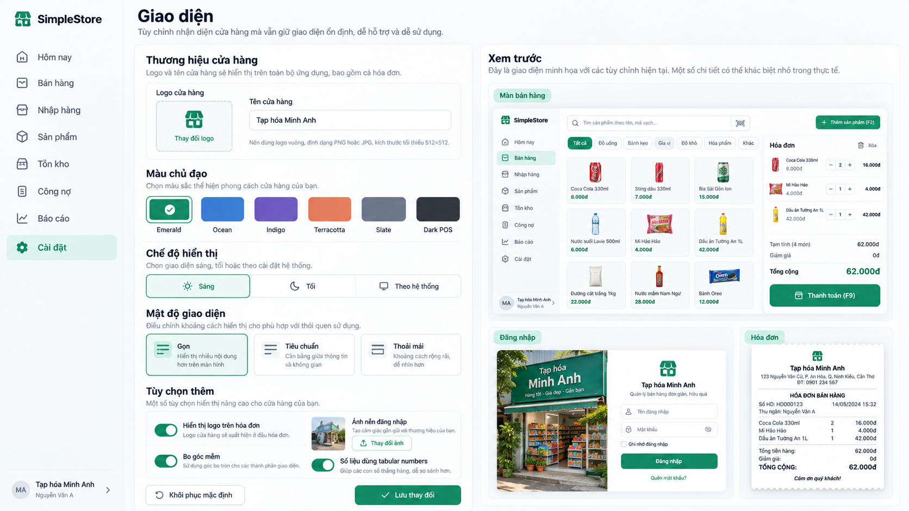

# Appearance settings v0.1

**Status:** Approved screen concept and visual reference — D-095. **Implementation:** NOT STARTED.

## Layout and controls

- Store branding: logo upload/replace and Store display name. Offer optional login/background branding where appropriate and optional receipt logo/branding.
- Theme presets: Emerald, Ocean, Indigo, Terracotta, Slate, Dark POS. Selection changes brand treatment within the semantic design system.
- Display mode: Light, Dark or System. Density: Compact / Gọn, Standard / Tiêu chuẩn or Comfortable / Thoải mái.
- Additional options may include a receipt-logo toggle, soft corner treatment and tabular numbers if retained during implementation. Their semantics must be explicit and consistent.
- Provide **Khôi phục mặc định** and **Lưu thay đổi**. The UI should distinguish unsaved changes from the currently saved Store appearance and make reset's effect understandable.

## Live preview

Show at least a Sales mini-preview, Login preview and Receipt preview for the pending appearance choices. Future implementation should use lightweight dedicated preview components, not embed the real application in the settings page. Preview content is illustrative; it must not create sales or print receipts.

Only **Owner** may mutate Store appearance. **Cashier** consumes the saved Store appearance. The selected theme, mode and density must keep important actions, warnings, errors and receipt information readable. Exact storage/API contracts and upload constraints belong to a later implementation review.

The [approved image](../references/appearance-settings-v0.1.png) sets visual intent; the [design system](../simple-store-design-system-v0.1.md) and written behavior govern implementation. The current Vue page has not been redesigned under D-095.
