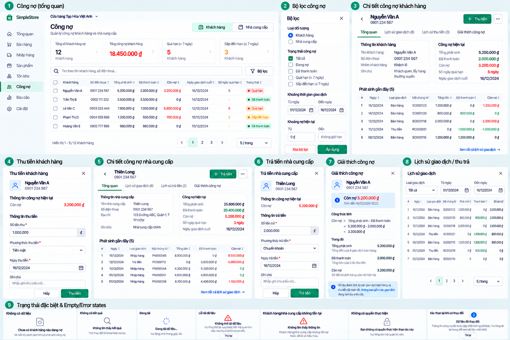

# Customer Collection and Supplier Settlement v0.1

**Status:** Approved visual/product UX direction — D-100. **Redesign implementation:** NOT STARTED. Existing DebtPayment behavior remains authoritative.

Customer form: identify the Customer, show authoritative current outstanding, accept an explicit amount, offer **Thu toàn bộ**, choose **Tiền mặt** (`Cash`) or **Chuyển khoản** (`Transfer`), allow an optional note, confirm, then show resulting balance. Supplier form mirrors the interaction with **Trả tiền nhà cung cấp** and **Trả toàn bộ**. The action and confirmation must state money direction: Customer collection is actual money received and **not new Revenue**; Supplier settlement is actual money paid and **does not change Purchase value/cost**. Neither operation allocates to an invoice or adds an advance/credit balance.

Amount must be `> 0` and `<=` authoritative current outstanding, with backend monetary precision. Optional DebtPayment note is trimmed/canonicalized, immutable after completion and limited to **250 characters** (D-055). It is not a structured invoice reference. Do not add overpayment, Customer advance, Supplier advance or direct balance editing. Return/Void effects remain their own correction events: a Return is not a DebtPayment, historical business dates are not rewritten, and D-056 prevents negative aggregate debt/handles required actual Customer refund when obligation reduction exceeds current debt.

## Concurrency and uncertain outcome

Before submission, capture the balance the user saw as `expectedOutstandingAmount`. If the backend returns `customer-debt-changed`, `supplier-debt-changed`, `debt-payment-exceeds-outstanding`, or the corresponding no-outstanding-debt error, **do not silently resubmit a changed amount**. Reload authoritative debt, explain the change and let the user review a new attempt.

Preserve one immutable attempt containing `OperationId`, party, amount, method, normalized note and expected outstanding. On an ambiguous network/server outcome, show **Chưa xác định được kết quả**, check the operation/target and retry the same exact attempt under the approved recovery contract. Do not generate a fresh OperationId while the earlier money movement may have committed. Handle idempotency-key reuse conflicts explicitly.

After success show actual amount, Cash/Transfer, backend `occurredAt`, outstanding before and after, and a clear confirmation. If outstanding becomes zero, reflect that the party has no current debt; do **not** claim a specific invoice was settled. Owner/Cashier may collect Customer debt; Supplier debt/settlement is Owner-only. Forms need loading, validation, stale debt, permission and safe retry states.
