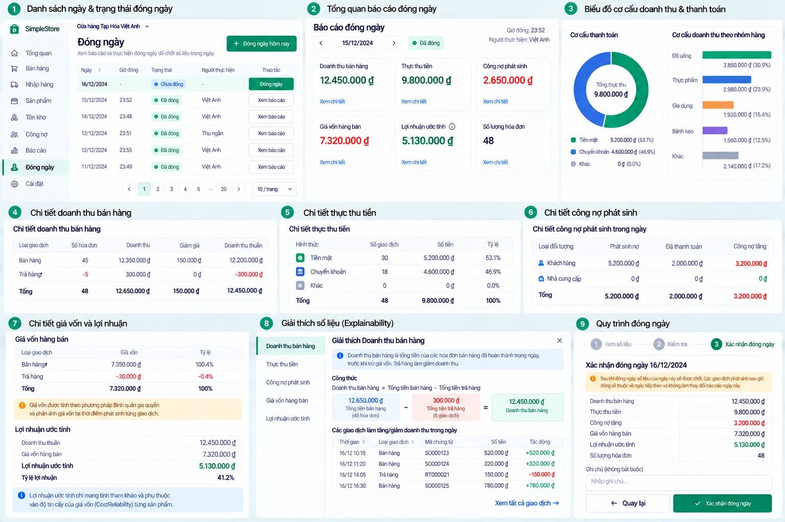

# End-of-day Detail and Evidence v0.1

**Status:** Approved visual/product UX direction — D-101. **Redesign implementation:** NOT STARTED.

The detail view must reconcile to the authoritative [EOD report](end-of-day-v0.1.md) for its exact Store-local `[startUtc, endUtc)` window. Present the backend totals even when source rows are unavailable; a visible page of records is not the whole calculation. Detailed typed evidence, source drill-down, pagination and extra charts remain `DESIGN DIRECTION APPROVED / API + TECHNICAL IMPLEMENTATION PENDING WHERE NOT CURRENTLY EXPOSED`.

## Sections and meaning

- **Doanh thu bán hàng:** show Completed Sales, Returns, Sale Voids/corrections and net Revenue with backend-authoritative event dates and signs. Returns reduce Revenue; they are not negative Sale Payments. The mock table and figures do not define an alternative revenue formula or expected values.
- **Tiền thu thuần:** separately show Sale Payments, standalone Customer Debt Payments, actual Customer Refunds and their net amount. `Net Collected = Sale Payments + Customer Debt Payments − Actual Customer Refunds` (D-053). Debt creation is not cash; collection of old debt is cash but not new Revenue. Any future method breakdown must reconcile exactly to the same net total and retain refund direction.
- **Công nợ cuối ngày:** label `customerOutstandingDebtAtEnd` and `supplierOutstandingDebtAtEnd` as ending balances at `endUtc`, not new debt generated within the date. Historic/as-of debt uses strict cutoff; today's current DebtBalance is a different view. Reuse [Debt Explainability](debt-explainability-v0.1.md) without inventing invoice/FIFO allocation. The mock's **Công nợ phát sinh** detail requires a separate API/semantic review of D-069 and cannot be substituted by ending debt.
- **Thanh toán nhà cung cấp:** `Supplier Payments = Purchase Payments + Supplier Debt Payments`, actual money out. A standalone Supplier DebtPayment does not change Purchase value/COGS and does not allocate to a particular Purchase document.
- **Giá vốn lịch sử và lãi gộp ước tính:** show authoritative Historical COGS and `Net Sales Revenue − Historical COGS`. Cost is based on SaleLine historical cost and Return/Void correction basis; later average-cost changes do not rewrite past gross profit. Put CostReliability `Reliable`/`Estimated`/`Unavailable` beside the estimate, not solely in a tooltip. It is not net/accounting profit and excludes operating expenses.

The image's **Số lượng hóa đơn** is not in `EndOfDayReport`. Historical SaleCount is `FUTURE / API REVIEW REQUIRED`; if added, explicitly review D-070 semantics for arbitrary dates. Cash/Transfer composition requires a collection/refund-method API. Category revenue needs D-097 Category domain plus reporting semantics; it is not implemented by D-101.

Before a detailed evidence API is built, define typed source events and stable IDs, pagination/order, event sign, Return/Void treatment, payment/refund direction, date cutoff, authorization, Store isolation, source navigation, reconciliation and performance. Do not parse localized text for transaction identity or silently sum only the visible page. A source link appears only when a safe authorized route exists. Distinguish zero transactions from unavailable detail, incomplete data and report load failure.
