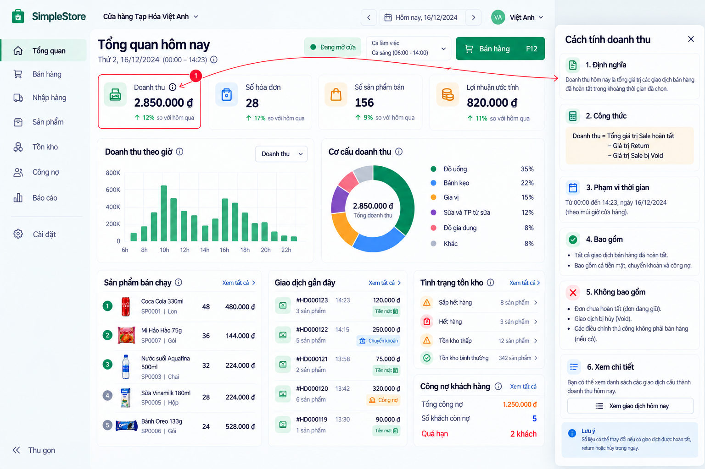

# Explainability Pattern v0.1

**Status:** Approved interaction direction — D-096 (2026-09-29). **Redesign implementation:** NOT STARTED.



## When and how to explain

Expose a small, keyboard-accessible explanation action such as an info icon, **Cách tính** or **Vì sao?** for important aggregates, estimates, derived KPIs, attention signals and accounting-like totals, especially where corrections or cutoffs materially change interpretation. Raw facts usually need no formula icon. Keep the default dashboard clean.

A tooltip is for one short clarification, such as `Doanh thu sau Return/Void trong ngày.` Use a focused side panel for definition, formula, included/excluded records, time scope, caveats and source navigation. Do not put a long formula in a hover-only tooltip; the detailed explanation must work by click/tap and keyboard. For a multi-section explanation, prefer the side panel shown in the [approved reference](../references/today-explainability-v0.1.png).

Each important derived metric/signal should answer four questions:

1. **Đây là số gì?** Give its business meaning in plain Vietnamese.
2. **Tính theo công thức nào?** Show an understandable expression that matches the authoritative domain calculation.
3. **Dữ liệu nào được tính vào / loại ra?** State inclusions, exclusions and corrections.
4. **Có thể xem dữ liệu cấu thành ở đâu?** Link to the contributing records when supported.

Where relevant, show the exact Store-local range and cutoff, data freshness, estimate/reliability wording and known limitations. Preserve the approved C13 flow **Summary → Vì sao? → Dữ liệu nguồn** with typed evidence and source references; never parse localized explanation text to drive logic (D-073–D-076).

## Revenue example

The reference's **Cách tính doanh thu** panel demonstrates these sections: **Định nghĩa**, **Công thức**, **Phạm vi thời gian**, **Bao gồm**, **Không bao gồm**, and **Xem chi tiết**. A readable presentation is:

```text
Doanh thu = Giá trị Sale hoàn tất − Giá trị Return − Giá trị Sale bị Void
```

This is explanatory wording, not a replacement for the approved shared Today/End-of-day financial projection. Describe the actual Return/Void event-date treatment and Store-local time window from the authoritative backend. Revenue is not collected cash; direct and standalone debt payments do not create Revenue (D-044, D-049). The included/excluded lists should clarify completed Sales, corrections, held/uncompleted orders and non-sale adjustments according to existing rules. **Xem giao dịch hôm nay** should open the contributing transaction set only when a safe, authorized drill-down exists.

## Other derived figures

- **Lợi nhuận ước tính:** explain `EstimatedGrossProfit = NetSalesRevenue − COGS`; COGS uses historical `SaleLine.UnitCostAtSale`/authoritative cost snapshots with Return/Void adjustments. Later average-cost changes do not revalue old Sales. Expose `CostReliability` and avoid presenting this as net/accounting profit (D-050, D-073–D-076).
- **Số hóa đơn:** clarify D-070 `SaleCount`: completed current-date Sales; same-day Void removes the Sale; partial/full Return does not reduce the count; cross-day Void does not create a negative count or rewrite history.
- **Số sản phẩm bán:** before this metric is built, resolve whether it means distinct SKUs or summed quantity and how Return/Void affect it. D-096 does not define that calculation.
- **Công nợ:** distinguish current outstanding debt from new debt created today. Explain the applicable business-date cutoff, contributing transactions/payments and Return/Void effects; offer authorized customer/supplier debt-history drill-down. Standalone `DebtPayment` does not allocate to individual invoices or reduce D-069 new-debt-created; preserve event-date corrections and non-negative debt rules (D-043–D-047, D-056, D-069).
- **Inventory attention/C14:** **Vì sao?** may show current stock, net sold quantity in the seven completed Store-local business days, historical period, average daily sales, and `DaysOfCover` only when the approved sufficiency and positive-sales rules permit it. Link to typed source evidence and the Product; follow D-071/D-072 active-only and data-sufficiency boundaries. C14 is deterministic/descriptive, not AI prediction, automatic replenishment advice or validated business value (D-064–D-068, D-071–D-076, D-084).

## Drill-down and boundaries

Where supported, a metric should lead to the records that formed it: **Doanh thu → Xem giao dịch hôm nay**, **Công nợ → Xem khách đang còn nợ**, **Sắp hết hàng → Xem sản phẩm / bằng chứng**. Preserve backend-selected typed navigation, pagination/reconciliation, authorization and Store isolation. If a source route is unavailable, say so clearly rather than implying the number is independently auditable through a dead action.

The sample revenue, counts, dates, percentages, transactions and wording in the image are illustrative, not expected test values or new accounting rules. Existing Product Owner-approved domain behavior prevails. The current `/today` UI has existing C13 explainability but predates this visual pattern; D-096 does not declare a redesign complete or change Slice 6/C14 validation status.
