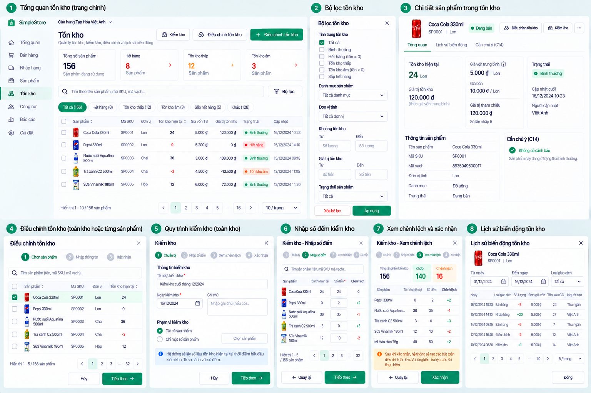

# Inventory Stocktake v0.1

**Status:** Product-level Stocktake is already implemented/approved under PR-A. Whole-inventory Stocktake UX direction is approved in D-099; its domain/technical implementation is **NOT STARTED / REQUIRES SEPARATE REVIEW**.

## Current Product-level contract

The existing Stocktake submission is for **one Product**: ProductId, expected quantity and revision, counted quantity, optional `AdjustmentUnitCost` when authoritative costing requires it, optional note and an OperationId. It creates an immutable StocktakeResult and typed `StocktakeAdjustment` movement when the difference is nonzero; a zero difference creates no fake movement. Counted quantity cannot be negative. D-087/D-088 govern positive and negative difference costing and reliability.

D-089 requires an exact expected balance revision. If inventory changed after the count context loaded, a typed `409 stocktake-stale` rejects the attempt. Show expected/current context and require refresh plus recount/new submission; never silently apply an obsolete difference. Preserve exact-attempt idempotency/recovery for uncertain outcomes. Product-level Adjustment remains a separate operation; its UI is specified in [Product Inventory Actions](product-inventory-actions-v0.1.md).

## Future whole-inventory flow

The approved **product/design direction** is **Chuẩn bị → Nhập số đếm → Xem chênh lệch → Xác nhận**. Searchable count entry may show Product name/SKU/unit, expected quantity, counted quantity, visible difference, progress and validation. Favor fast keyboard entry for large counts. Before confirmation, clearly distinguish matched Products, positive/negative differences and stale/conflicted Products without relying on color alone. A prominent confirmation action must describe the inventory effects. This visual flow does **not** create a StocktakeSession aggregate, bulk API or schema under D-099.

Before any implementation, Product Owner/domain/technical review must resolve: whole Main Warehouse or Product subset; snapshot time; per-Product expected revision; adding/removing Products after counting begins; Sale/Purchase changes during counting; all-or-nothing versus per-Product confirmation; partial stale behavior; resume after logout/restart; OperationId scope and retries; positive-difference cost/CostReliability per Product; audit/source history; and who may create, cancel or complete a session. D-099 answers none of these. Any future multi-Product flow must preserve D-089's principle: a changed authoritative balance must not silently accept an obsolete difference.

Whole-inventory Stocktake remains **DESIGN DIRECTION APPROVED / DOMAIN + TECHNICAL IMPLEMENTATION NOT STARTED**. Owner-only mutation, Store/Main Warehouse scope, immutable ledger and existing costing contracts stay authoritative. Provide intentional loading, validation, stale/conflict, uncertain outcome and permission states.
