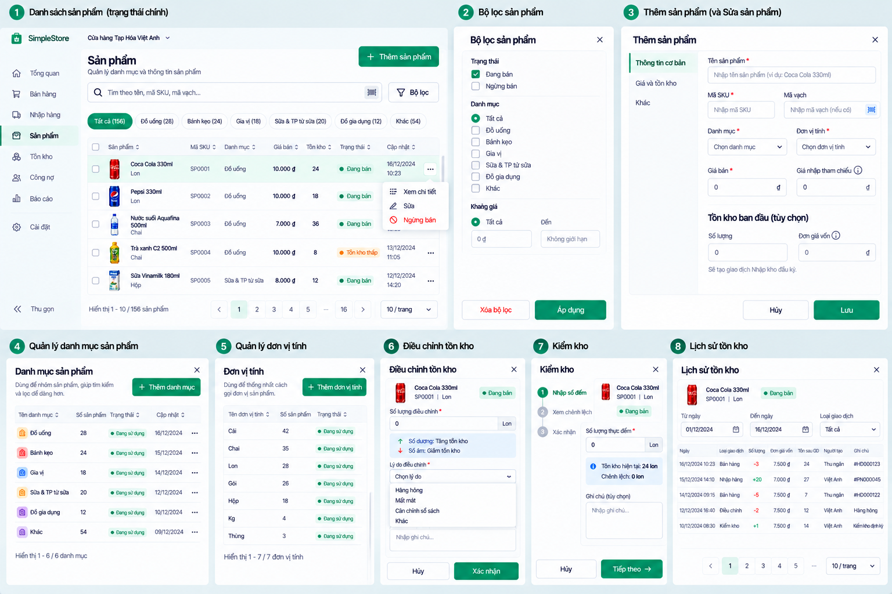

# Product Category and Unit direction v0.1

**Status:** Approved product/design direction — D-097. **Category/Unit domain, schema and UI implementation:** NOT STARTED; separate Product Owner domain/technical review required.

## One-level Product Category

The approved direction is a simple Owner-managed, **one-level** Category list for Product organization and filtering. The intended management actions are add, rename/edit and deactivate. A referenced Category must not be hard-deleted; inactive Categories must remain understandable on historical Products. The pictured **Đồ uống**, **Bánh kẹo**, **Gia vị**, **Sữa & TP từ sữa**, **Đồ gia dụng** and **Khác** are examples, not seeded values or a mandatory taxonomy. D-097 does not approve a multi-level tree.

The current Product domain/schema does **not** establish Category. Before coding, separately review identity, Store scope, uniqueness, reference/deactivation behavior, migration of existing Products, authorization and Product/filter API effects. The approved image is not a schema design.

## Reusable Unit master data

The approved direction is an Owner-managed reusable Unit list. A Product chooses one base unit; inactive units stay historically understandable. **Cái**, **Chai**, **Lon**, **Gói**, **Hộp**, **Kg** and **Thùng** are examples. The current implementation stores Product `Unit` directly as a **string**. D-097 does not authorize replacing that field with a Unit entity or migrating existing data; identity, Store scope, rename/deactivation, snapshot/history and migration behavior require separate Product Owner technical/domain review.

## Explicit non-scope: package conversion

Reusable units do **not** approve conversions such as `1 thùng = 24 lon` or `1 lốc = 6 chai`. Multi-unit/package conversion requires a separate domain decision because it affects Purchase, Sale, Inventory, costing, barcode, Stocktake and Return/Void. The mockup's package-size field is illustrative only. Do not build a conversion engine under D-097.

Only authorized Owner configuration actions may be shown. The current string Unit and existing Product/Inventory contracts remain authoritative until a separately approved implementation exists.
