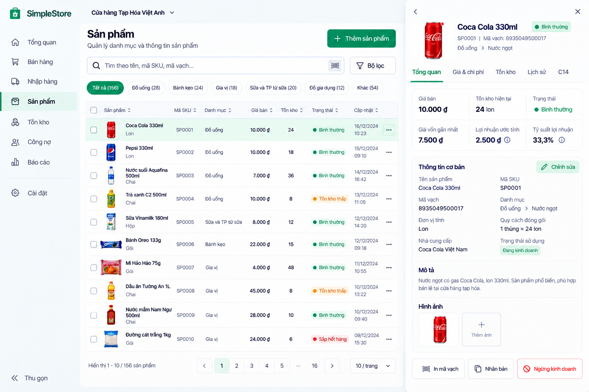

# Product List and Filter v0.1

**Status:** Approved visual/product UX direction — D-097. **Redesign implementation:** NOT STARTED.

The page leads with **Sản phẩm**, a fast name/SKU/barcode search, a compact **Bộ lọc** action and an Owner-only primary **+ Thêm sản phẩm** action. Use a desktop table optimized for scanning, pagination and a row action menu. Preferred visible fields are Product name/unit, SKU, Category **when supported**, sale price, current stock, active status and updated time where useful. Keep the table compact; do not require every Product fact to appear in each row. Product pictures are desirable future recognition aids, subject to the separate image-storage review in [Product Detail](product-detail-v0.1.md).

## Filter panel

Open a focused drawer/panel with clear **Xóa bộ lọc** and **Áp dụng** actions. Current-safe concepts are name/SKU/barcode search and active/inactive state. Category and inventory-state filters are future UX direction only; expose them only after their domain meaning, data and backend support have been approved and implemented. A mockup filter must not become an invented API capability. Show applied filters and distinguish zero Products in the Store from zero results after filtering.

## Row actions and permissions

The context menu may offer supported **Xem chi tiết**, **Sửa** and **Ngừng bán** actions. Only show actions authorized for the current role. Keep deactivation separate and confirm its effect; do not hard-delete historical Product, Sale or movement data. Inactive Products remain historically understandable. Stock-state labels such as **Bình thường**, **Tồn kho thấp** and **Sắp hết hàng** need an exact mapping to approved stock facts/C14 semantics before implementation; do not invent arbitrary thresholds or equate no C14 signal with “healthy stock.”

Use stable sorting/pagination and readable long Vietnamese names. Loading, empty list, no search match and API failure each need distinct states. On tablet the detail can open as a drawer/full overlay; on mobile show a readable sequential list and detail flow. The [management overview](product-management-v0.1.md) defines precedence and scope; the second [approved states reference](../references/product-management-states-v0.1.png) illustrates the filter and row menu.
