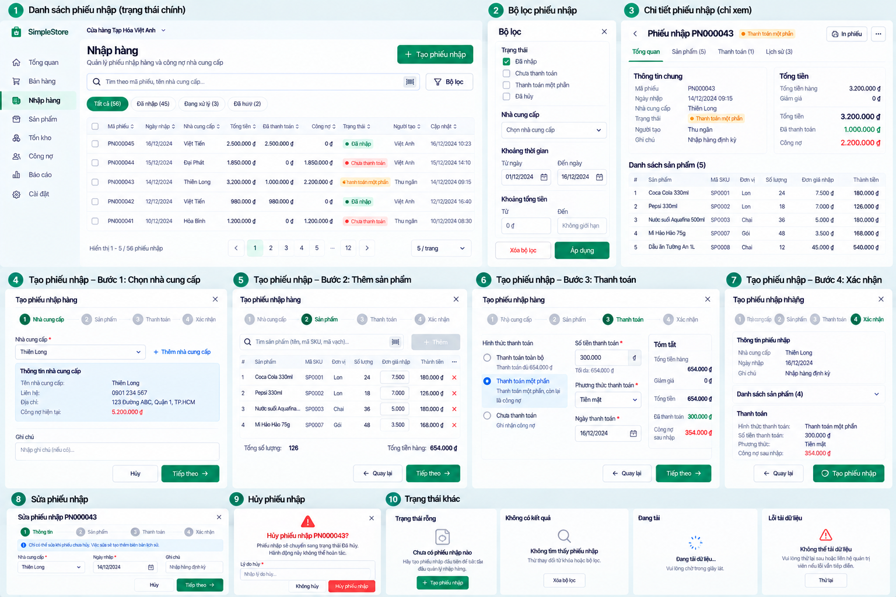

# Purchase List and Filter v0.1

**Status:** Approved visual/product UX direction — D-098. **Redesign implementation:** NOT STARTED.

Use a clear **Nhập hàng** heading and an Owner-only primary **+ Tạo phiếu nhập** action. Keep the desktop list scan-friendly: Purchase identity where available, date, Supplier, total, original paid amount, outstanding contribution, lifecycle, separate Void indication, and actor/update information only where the backend supplies it. Use tabular numerals and pagination without overloading the table. The current list result exposes Purchase ID, Supplier, `Draft|Completed`, total, paid, outstanding, created/completed timestamps and `isVoided`; the picture's human-readable document number and actor/update columns are not guaranteed current API fields.

## Lifecycle and payment presentation

`Draft` and `Completed` are the only lifecycle statuses; Void is separate. For a non-voided Completed Purchase, payment labels such as **Chưa thanh toán**, **Thanh toán một phần** and **Đã thanh toán** may be derived from authoritative total, original paid and outstanding amounts. Do not persist them as new aggregate statuses or use payment labels to hide Draft/Completed. Show **Đã hủy** distinctly while preserving the historical row and original transaction facts. The pictured badge **Đã nhập** can be user-facing wording for completion only if the lifecycle meaning stays clear.

## Filter panel

Use a focused panel with obvious **Xóa bộ lọc** and **Áp dụng** actions. Lifecycle status, Void state, Supplier, date range and total range are potential filter concepts, but expose only filters supported by the backend when implemented. The current Purchase list API supports `status`, `page` and `pageSize`; the image does not authorize a search/supplier/date/amount/void API filter. Distinguish **no Purchases yet** from **no matches for these filters**, and show loading and list-load errors explicitly.

Row navigation and actions follow existing Owner authorization. Do not add direct edit or delete to Completed Purchase rows. On tablet/mobile keep the important identity, Supplier, lifecycle and money values readable through an adapted/sequential layout, not a compressed wide table. The [management overview](purchase-management-v0.1.md) defines contract precedence.
