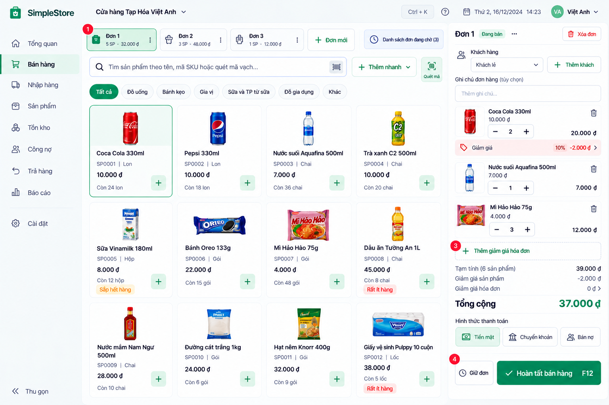

# Sales screen v0.1

**Status:** Approved screen concept — D-095. The D-106 [Sales HTML Visual Reference v1.0](../approved/sales-html-reference-v1.0/index.html) is the visual source of truth for UI-B production alignment; D-105 remains the capability boundary. **Production alignment:** NOT YET APPROVED / PENDING PRODUCT OWNER REVIEW. **Production polish:** [Sales Production Polish v0.1](../../architecture/sales-production-polish-v0.1.md) scope `APPROVED — D-107`; Pass 1 `APPROVED / COMPLETED — D-108`; Pass 2 `IMPLEMENTED / PENDING PRODUCT OWNER REVIEW`; Pass 3 `NOT STARTED`. Live mode shows only supported capability; visual-only elements stay in Demo / Visual Reference mode.

## Working layout

- **Left:** navigation sidebar.
- **Center:** active/held order selector; product search and barcode input; category filters; product grid with readable name, SKU/unit, price, stock quantity/status and quick add.
- **Right:** active Sale/cart with customer, optional note, cart lines, item discount actions, invoice discount, totals, payment method, **Giữ đơn** and **Hoàn tất bán hàng**.

Desktop POS is the primary target. On tablet the grid adapts, navigation may collapse and checkout remains visible. On mobile, present the same workflow sequentially. Preserve long Vietnamese names and fast keyboard/barcode use. Treat empty, loading and error states as first-class UI; keep warnings meaningful and avoid nested modals in ordinary cashier flow.

## Multiple working and held orders

The approved selector concept is `[ Đơn 1 ] [ Đơn 2 ] [ Đơn 3 ] [ + Đơn mới ] [ Danh sách đơn đang chờ ]`. Use customer-facing terms **Giữ đơn**, **Đơn đang chờ** and **Đơn mới**, rather than “Draft Sale” in the UI. A cashier can hold customer A's order, complete B's order, then return to A.

Each working/held order owns its own product lines, quantities, customer, note, item discounts and invoice discount. Switching orders must preserve those details; completing B must not change A. Deleting or canceling a held order requires confirmation. A completed order leaves the working-order list.

### Future domain requirement — separate review required

A Held Sale is **not** a Completed Sale. Holding an order must create no `InventoryMovement`, Revenue, Debt, Payment or COGS. For MVP, holding does not reserve stock unless a later Product Owner decision changes that rule. Final checkout must revalidate authoritative stock, price and business rules. The preferred future architecture is a server-side persisted `HeldSale`/`SaleDraft` so refresh or browser restart does not lose held orders.

This is approved UX/product direction, **not an implemented domain model**. A separate Product Owner technical/domain review is required before coding it. Existing Sale/Return decisions and checkout contracts remain authoritative.

## Discounts and totals

- Item discounts start collapsed behind a small **Giảm giá** action on the corresponding cart line. Opening it offers exactly one mode per discount: percent (`%`) or fixed amount (`₫`). After application, display the result compactly, for example `Giảm 10%  -2.000đ`; do not leave large discount forms permanently open on each line.
- Invoice discount starts collapsed behind **+ Thêm giảm giá hóa đơn**. Opening it offers percentage or fixed amount. After application, show the mode/value, calculated amount and edit/remove controls.
- Distinguish subtotal, product discounts, invoice discount and final total clearly.

These are approved visual/product interactions. D-095 does not approve discount calculation rules, persistence, authorization or accounting effects; those require separate Product Owner domain/technical review before implementation.

## Checkout and printing

Before completion, **Hoàn tất bán hàng** is the primary action; **Giữ đơn** is secondary. Destructive actions such as deleting an order remain visually separate. A shortcut such as `F12` may be displayed only when it actually works. Keep one obvious primary action per workflow and minimize clicks in normal cashier use.

Do not present **In hóa đơn** as an equivalent primary action before completion. After successful completion, show a completion state with **In hóa đơn**, **In lại hóa đơn** where appropriate, and **Đơn bán mới**. Printing is independent from transaction completion: print success, failure or cancellation must never decide whether a Sale is completed. A stored completed Sale can be reprinted.

The [D-106 approved HTML prototype](../approved/sales-html-reference-v1.0/index.html) defines UI-B visual implementation; this [original D-095 image](../references/sales-screen-v0.1.png) remains design inspiration. Sample prices, products, stock counts, discounts and labels are illustrative, not live data or domain rules. Written Product Owner-approved behavior prevails on conflict. Prototype features marked `VISUAL-ONLY` do not expand the D-105 capability boundary, and D-106 does not approve the current Vue Sales UI.
