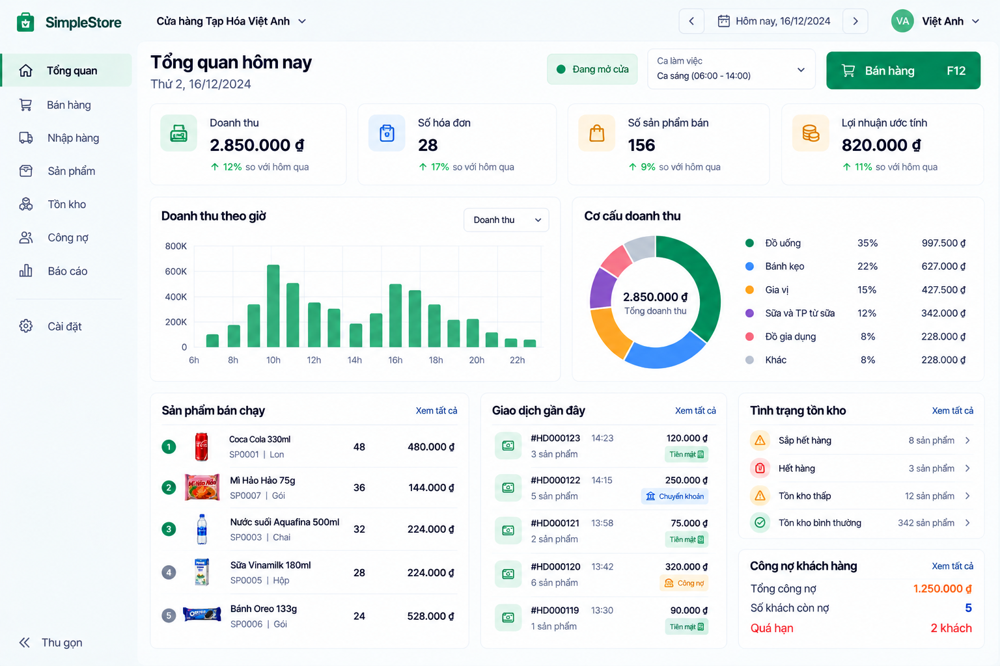

# Today screen v0.1

**Status:** Approved visual direction — D-096 (2026-09-29). **Redesign implementation:** NOT STARTED.

## Purpose and hierarchy

Today answers **“Hôm nay cửa hàng thế nào, và điều gì cần chú ý tiếp theo?”** It is an operational overview for the Owner, not a generic business intelligence dashboard. Show a compact headline first, then supporting evidence and useful actions. Keep the primary route to **Bán hàng** obvious.

The header presents **Tổng quan hôm nay**, the exact Store-local business date and time scope/cutoff, Store state where applicable, and the Sales shortcut. Current `/today` is Owner-only and uses the backend-authoritative current business date under `Store.TimeZoneId`; its window follows the approved Store-local semantics. The mockup's date arrows, past date and shift selector are visual examples, not approval to add historical Today navigation, shift filtering or a new time-window rule. Those controls need separate product/domain review before becoming functional. Historical reporting remains in End-of-day under D-073.

## Primary metrics

The visual KPI row illustrates **Doanh thu**, **Số hóa đơn**, **Số sản phẩm bán** and **Lợi nhuận ước tính**. Present money and counts for rapid scanning, use clear comparison labels only when the comparison is actually defined, and offer contextual explanation on important derived figures. These are sample KPI types, not a change to the existing Today response or backend calculations.

- Revenue follows the shared Today/End-of-day financial projection and remains distinct from money collected (D-049, D-073–D-076).
- `SaleCount` counts Completed Sales in the current Store-local business-date window, excludes same-day Voids, is not reduced by Returns, and is not made negative by cross-day Voids (D-070).
- **Số sản phẩm bán** needs a separately reviewed definition before implementation: SKU count and summed sold quantity are different measures, and corrections may affect them differently.
- **Lợi nhuận ước tính** is Estimated Gross Profit, not accounting/net profit. It uses historical sale-line cost snapshots and communicates `CostReliability` where material (D-050, D-073–D-076).

## Supporting content

The approved composition may include revenue over time, revenue breakdown, best-selling products, recent transactions, inventory attention, customer debt and relevant Today/C14 signals. Charts and lists should help the Owner understand the headline or take the next authorized action. Their data definitions, filters, ranking and comparison periods require the existing contract or separate review; the image does not create new endpoints or formulas.

Inventory attention must preserve the intentionally thin C14 Today preview: at most three active Product attention items, factual conditions before risk, with **Xem vì sao** and access to the full list when relevant (D-066, D-071–D-076). The illustrated inventory-status summary and “normal stock” count do not assert that all other Products are healthy. C14 remains deterministic/descriptive, not AI prediction or replenishment advice.

The image's **Công nợ khách hàng** total is distinct from the existing Today **CustomerDebtCreated** metric, which measures new obligations created today under D-069. Any outstanding-debt card must use the approved debt history/cutoff semantics, and must not relabel CustomerDebtCreated as total outstanding debt or invent invoice allocation/FIFO.

## Interaction and trust

Important derived metrics and signals can open the [Explainability Pattern](explainability-pattern-v0.1.md): summary → **Vì sao?** → source records, with a focused side panel for multi-section explanations. Drill-down respects authorization and Store isolation. The main screen stays calm; do not put an info icon beside every raw fact.

The image's numbers, products, percentages, dates, transaction IDs, opening state, shift and comparison badges are illustrative only: they are not expected test values, implemented features or new domain rules. Existing Product Owner-approved Slice 5/6 decisions win on any conflict. The current Vue `/today` implementation predates this design extension and is not claimed to match this reference; future redesign needs separate implementation/technical review.
